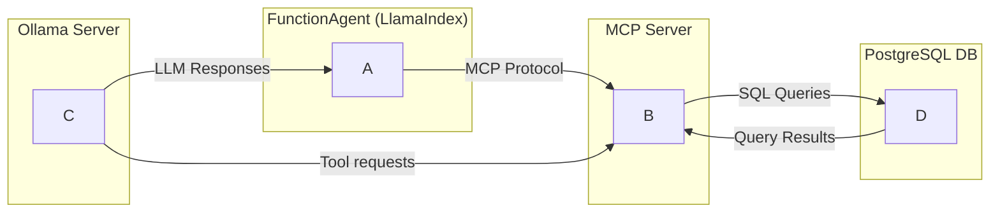

# autogen-llamaindex-ollama-agenitc

## Overview

This project provides an agentic, tool-driven system for interacting with a PostgreSQL database using natural language. It leverages LlamaIndex, Ollama, and a custom workflow to interpret user requests, select appropriate database tools, and execute operations transparently. The system is designed for extensibility and ease of use, supporting both Dockerized and manual setups.

## Features
- **Natural Language Database Operations:** Query, insert, update, and manage your database using plain English.
- **Tool-Driven Execution:** All actions are performed via explicit tool calls, ensuring transparency and auditability.
- **PostgreSQL Backend:** Uses PostgreSQL as the default database (configurable).
- **Agent Workflow:** Modular workflow with memory, event-driven steps, and LLM-powered reasoning.
- **Docker Support:** Easy setup with Docker Compose for both the app and database.

## Architecture


- **main.py:** Entry point; runs the agent workflow loop.
- **scripts/workflow.py:** Defines `DatabaseWorkflow`, orchestrating LLM, tool selection, and execution.
- **mcp/mcp_server.py:** Implements the MCP server exposing database tools (CRUD, schema, etc.).
- **config/settings.py:** Loads configuration for Ollama (LLM) and database from environment variables.
- **config/prompts.py:** System prompt guiding the agent's behavior.
- **Dockerfile & docker-compose.yml:** Containerized setup for app and PostgreSQL.

## Setup

### 1. Docker Compose (Recommended)
Ensure you have Docker and Docker Compose installed.

```sh
git clone <this-repo-url>
docker-compose up --build
```

- The app will be available in the `Agent_MCP_Server` container.
- PostgreSQL runs in the `postgres_db` container (default user: `postgres`, password: `postgres`, db: `testdb`).
- You can customize environment variables in `.env.docker`.

### 2. Manual Setup
- Install Python 3.12+
- Install dependencies:
  ```sh
  pip install -r requirements.txt  # or use pyproject.toml with pip/uv
  ```
- Ensure PostgreSQL is running and accessible (see `config/settings.py` for defaults).
- Set environment variables as needed (see `.env.docker` for examples).
- Start the MCP server and main workflow:
  ```sh
  python mcp/mcp_server.py &
  python main.py
  ```

## Usage
- On startup, the agent will prompt: `What would you like to do?`
- Enter natural language requests, e.g.:
  - `Show me all the tables in the database.`
  - `Add a new customer: 'Alice', 'alice@email.com', 25 to the customers table.`
- The agent will:
  1. Interpret your request
  2. Select and call the appropriate database tool(s)
  3. Return the result

### Example Interaction
```
What would you like to do? Show me all the tables in the database.
Tool: list_tables()
Output: The available tables are: customers, products, orders
```

## Directory Structure
```
config/           # Prompts and settings
mcp/              # MCP server and database tool definitions
scripts/          # Workflow and event logic
main.py           # Entry point
Dockerfile        # App container
docker-compose    # Initiates the app, database and MCP server (Make sure ollama is serving)
```

## Dependencies
- Python 3.12+
- llama-index-llms-ollama
- mcp[cli]
- mlflow
- ollama
- psycopg2-binary
- python-dotenv
- (see `pyproject.toml` for full list)

## Configuration
- **Ollama LLM:** Set via environment variables (see `config/settings.py`).
- **Database:** Set via environment variables (see `config/settings.py`).

## Contributing
Pull requests and issues are welcome! Please open an issue to discuss major changes.
